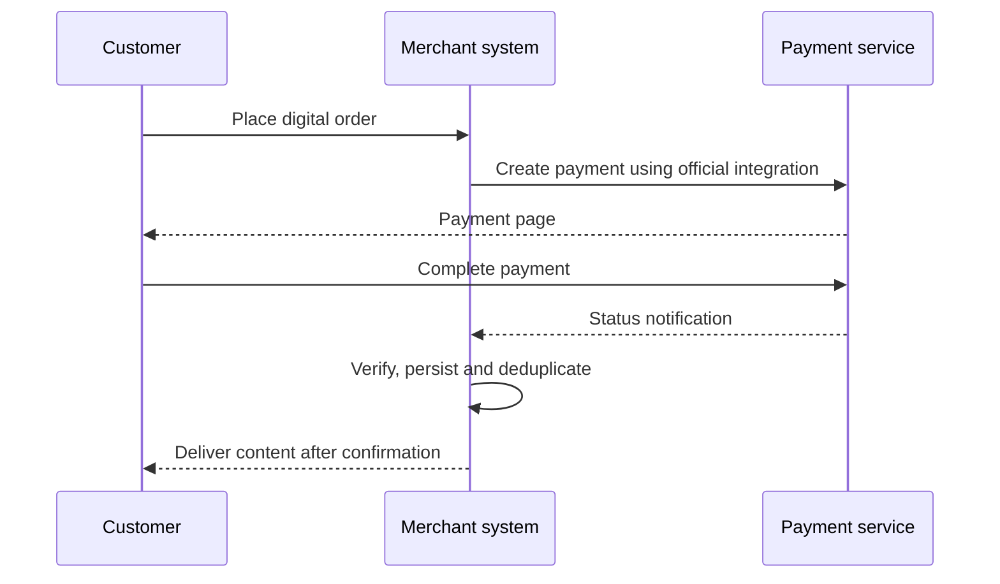

[Repository home](../README.md) · [简体中文](workflows.zh-CN.md)

# Merchant workflow recipes

These are business-flow templates, not real API calls or event schemas.

## Payment link

1. Create the merchant order and determine the amount.
2. Create a payment link using the official merchant workspace.
3. Associate the collection record with the business order.
4. Share the link and let the customer complete payment.
5. Verify confirmed status and reconcile before fulfillment.

## Digital delivery

Keep delivery separate from payment reception. A valid confirmed payment may still require a retryable fulfillment job. Record delivery status and prevent a duplicated event from issuing the same entitlement twice.

## Service renewal

1. Record the service account, selected plan and renewal period.
2. Create and associate the payment using the formal integration.
3. Verify payment confirmation and order association.
4. Apply the renewal once, using the merchant’s own entitlement rules.
5. Keep an audit record of the previous and resulting expiration dates.

This recipe describes paying for a renewal. It does not claim automatic recurring debits or subscription billing APIs.

## Failure handling

| Situation | Merchant responsibility |
| :--- | :--- |
| Duplicate notification | Do not repeat delivery or credit |
| Delayed confirmation | Keep the order pending under defined policy |
| Confirmed payment, failed delivery | Retry fulfillment without recharging |
| Short, excess or expired payment | Follow the official product/support process |
| Network mismatch | Escalate through support; do not promise recovery |

[Integration planning](https://github.com/jangopay/jangopay-docs) · [Contact](mailto:contact@jangopay.org)
