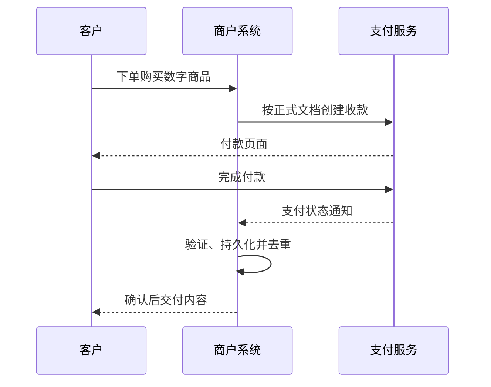

[返回仓库首页](../README.zh-CN.md) · [English](workflows.en.md)

# 商户接入流程模板

以下内容描述业务流程，不代表真实 API 请求或事件字段。

## 收款链接

1. 创建业务订单并确定付款金额。
2. 在正式商户后台创建收款链接。
3. 将收款记录与业务订单关联。
4. 分享链接，由客户完成付款。
5. 确认付款状态，核对订单后再交付。

## 数字交付

付款接收与商品交付需要分别管理。即使付款已确认，也可能需要重试交付任务。记录交付状态，避免重复事件导致同一权益被重复发放。

## 服务续费

1. 记录服务账户、所选套餐与续费周期。
2. 按正式接入方式创建付款，并关联订单。
3. 验证付款确认结果与订单对应关系。
4. 根据商户自己的权益规则，仅执行一次续期。
5. 记录续期前后的到期时间，便于审计和核对。

本流程描述客户为续费付款，不代表产品提供自动周期扣款或订阅账单接口。

## 异常处理

| 情况 | 商户侧处理职责 |
| :--- | :--- |
| 重复通知 | 不重复交付或增加额度 |
| 确认延迟 | 按业务政策保留待处理订单 |
| 已确认付款但交付失败 | 重试交付，不再次收费 |
| 少付、多付或超时付款 | 遵循正式产品与支持流程 |
| 网络不匹配 | 提交支持处理，不承诺一定恢复 |

[接入规划文档](https://github.com/jangopay/jangopay-docs) · [联系团队](mailto:contact@jangopay.org)
